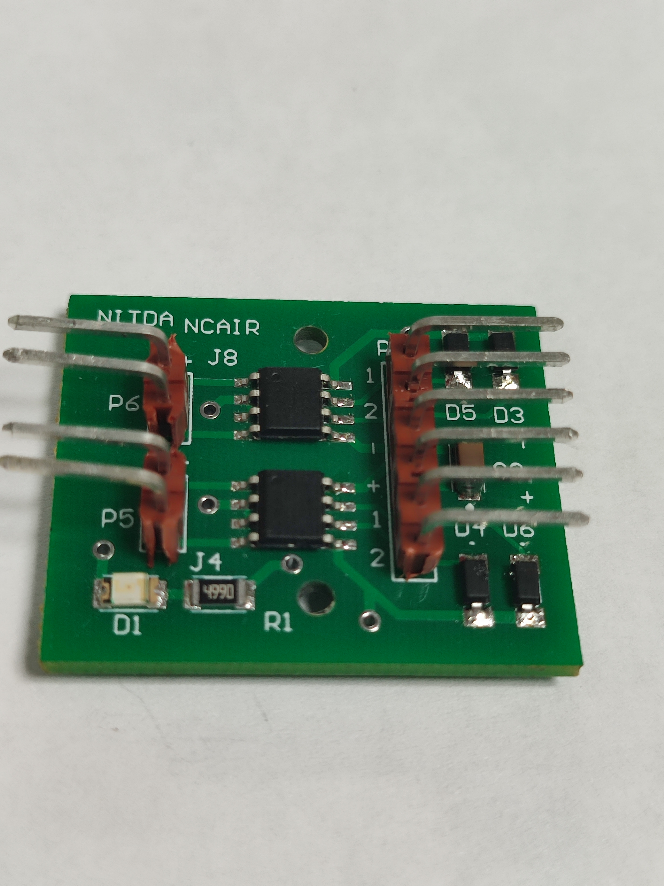

# NCAIR_Rasp-Bot: Raspberry Pi-Powered Autonomous UGV

## This documentation is incomplete 

Welcome to the NCAIR_Rasp-Bot project! This repository contains code, resources, and documentation for building and programming an autonomous Unmanned Ground Vehicle (UGV) powered by a Raspberry Pi. The project includes various modes such as basic motion, collision avoidance, object following, road following, and teleoperation.

## Table of Contents

- [Introduction](#introduction)
- [Components](#components)
- [Modes](#modes)
- [Getting Started](#getting-started)
- [Contributing](#contributing)
- [License](#license)

## Introduction

The NCAIR_Rasp-Bot project aims to provide an accessible platform for building and experimenting with autonomous robots using a Raspberry Pi. Whether you're a beginner or an experienced maker, this project offers a hands-on learning experience in robotics and programming.

## Components

To build and experiment with the NCAIR_Rasp-Bot, you'll need the following components:

1. Raspberry Pi: The core computing unit that runs the robot's software and controls its various functionalities. You can use a Raspberry Pi 3 or 4 Model B. (running Bullseye)
   

2. Raspberry Pi Camera Module: A camera module that attaches to the Raspberry Pi and provides visual input for tasks such as object detection, navigation, and more.
   

3. Motor Driver: A motor driver module or H-bridge circuitry that interfaces between the Raspberry Pi and the robot's motors. It enables control over motor direction and speed. NCAIR Motor Driver was used in this project.
   

4. DC Motors: The motors that drive the wheels or tracks of the robot. Choose motors suitable for your robot's size and weight.
   

5. Chassis: The physical body or framework of the robot where all the components are mounted. It provides structural support and helps protect the internal components. A revised version of the NVIDIA Jetbot chassis was used.
   

6. Wheels/Tracks: The wheels or tracks that allow the robot to move. Choose appropriate wheels or tracks based on your robot's design and intended terrain.
   

7. Power Source/Battery: A suitable power source to provide energy to the Raspberry Pi, motors, and other components. Make sure it can supply enough voltage and current for your robot's needs. The NCAIR robot Power Box was used in this project.
   

## Modes

The NCAIR_Rasp-Bot project includes the following modes:

- [Basic Motion](basic_motion/readme.md)
- [Collision Avoidance](collision_avoidance/readme.md)
- [Object Following](object_following/readme.md)
- [Road Following](road_following/readme.md)
- [Teleoperation](teleoperation/readme.md)

Each mode provides a unique functionality and learning experience. Refer to the mode-specific directories for code and instructions.

## Getting Started

To get started with the NCAIR_Rasp-Bot project, follow the instructions in the [Getting Started Guide](GettingStarted.md).

## Contributing

Contributions to this project are welcome! If you have ideas, improvements, or fixes, please open an issue or submit a pull request.

## License

This project is open-source and available under the [MIT License](LICENSE). Feel free to use and modify the code for your own projects.

---

For more detailed information, refer to the mode-specific README files in each mode's directory.
